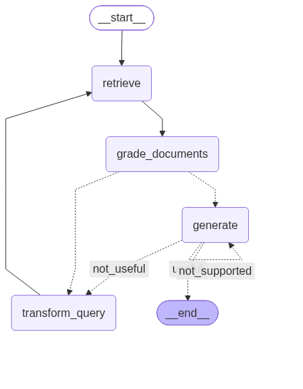

# Self-RAG — Self-Reflective Retrieval-Augmented Generation

A production-structured implementation of **Self-RAG**: a RAG system that grades its own retrieval *and* its own generated answers, then self-corrects through feedback loops — regenerating when it hallucinates and re-retrieving when the answer misses the question.

Built from scratch in **LangGraph** with a MAANG-standard project layout (layered `src/`, centralized config, custom exceptions, structured logging, tests).

> Part of a multi-repo RAG series progressing from Naive RAG → Advanced techniques → CRAG → **Self-RAG**. Each repo builds deeper self-correction on top of the last.

---

## Why Self-RAG?

Naive RAG retrieves and generates blindly. CRAG adds one check — *are the retrieved documents relevant?* — and falls back to web search. But even CRAG trusts its own generation: it never asks whether the answer it produced is actually **grounded in the documents** or **answers the question**.

Self-RAG closes that gap. It reflects on both sides of the pipeline:

- **Input side** — is each retrieved document relevant? (ISREL)
- **Output side** — is the generated answer grounded in the documents? (ISSUP) and does it address the question? (ISUSE)

When a check fails, the system doesn't ship a bad answer — it **loops back and corrects itself.**

---

## How it works

```
          ┌──────────────────────────────────────────────┐
          │                                              │
START → retrieve → grade_documents → [relevant?]         │
                                       │                  │
                    no relevant docs ──┴─→ transform_query┘  (re-retrieve)
                                       │
                              docs ok  ▼
                                   generate ─→ [grade generation]
                                                 │
                    hallucinated (ISSUP: no) ────┴─→ generate      (regenerate)
                    doesn't answer (ISUSE: no) ──────→ transform_query (re-retrieve)
                    grounded + answers ─────────────→ END
```

Two self-correction loops, bounded by a retry limit:

| Check | Question | On failure |
|-------|----------|-----------|
| **ISREL** | Is the document relevant? | drop it; if none left → re-retrieve |
| **ISSUP** | Is the answer grounded in the docs? | **regenerate** (same docs) |
| **ISUSE** | Does the answer address the question? | **re-retrieve** (rewrite query) |

A `MAX_RETRIES` counter in the graph state caps the loops — without it, a query that never satisfies the checks would loop forever. On hitting the cap, the system returns its best attempt instead of hanging.

---

## Key design decisions

### LLM-based reflection, not thresholds
Each check is an LLM grader with **structured (binary) output** via Pydantic schemas — not a similarity score. A threshold only measures vector closeness; an LLM reasons about whether a document actually answers the question, or whether an answer is genuinely grounded. This is what makes the self-correction meaningful rather than mechanical.

### Prompt-based approximation of reflection tokens
The original Self-RAG paper uses a model fine-tuned to emit special reflection tokens (`Retrieve`, `ISREL`, `ISSUP`, `ISUSE`) mid-generation. This repo approximates that behavior with prompt-based grading on a general LLM — the same reflective logic, without requiring specialized fine-tuning. *(An authentic fine-tuned-model version is tracked separately.)*

### Bounded loops
Feedback loops are powerful but risk infinite retries. The `retries` counter is part of the graph state and is checked before every correction — production safety baked into the graph, not bolted on.

### Ordered checks
Hallucination (ISSUP) is checked **before** answer-relevance (ISUSE). If an answer isn't even grounded, there's no point asking whether it addresses the question — fix grounding first, then evaluate relevance.

---

## Project structure

```
self-rag/
├── src/
│   ├── components/          # reusable pieces
│   │   ├── loader.py        # PDF loading with validation + custom errors
│   │   ├── chunker.py       # recursive splitting, metadata preserved
│   │   └── vector_store.py  # HuggingFace embeddings + FAISS (cosine)
│   ├── pipeline/            # Self-RAG orchestration
│   │   ├── state.py         # GraphState (question, documents, generation, retries)
│   │   ├── nodes.py         # nodes + three graders + two decision functions
│   │   └── graph.py         # StateGraph assembly with feedback loops
│   ├── config/
│   │   └── settings.py      # centralized paths, models, params, MAX_RETRIES
│   ├── utils/
│   │   ├── logger.py        # structured logging setup
│   │   └── exceptions.py    # custom exception hierarchy
│   └── entity/
│       └── schemas.py       # Pydantic grading schemas (ISREL, ISSUP, ISUSE)
├── tests/                   # unit + integration tests
├── artifacts/               # FAISS index (gitignored)
├── notebooks/               # experiments
├── main.py
├── requirements.txt
├── pyproject.toml
├── Dockerfile
└── README.md
```

The layering is deliberate: components are swappable, orchestration is isolated in `pipeline/`, and every hardcoded value lives in `config/`. This is what makes the system testable and maintainable rather than a single script.

---

## Setup & usage

```bash
# 1. Clone
git clone https://github.com/Nitesh-lng/Self_RAG.git
cd Self_RAG

# 2. Virtual environment
python3.12 -m venv SRAG
source SRAG/bin/activate

# 3. Install
pip install -r requirements.txt

# 4. Add your Groq API key
echo "GROQ_API_KEY=your_key_here" > .env

# 5. Place a PDF at data/data.pdf and run
python main.py
```

On first run the FAISS index is built into `artifacts/` and reused thereafter. The logs show each reflection step live — `---RETRIEVE---`, `---GRADE DOCUMENTS---`, `---GENERATE---`, `---GRADE GENERATION---` — so you can watch the self-correction happen.

---

## Self-RAG vs CRAG vs Naive

| | Naive RAG | CRAG | Self-RAG |
|--|-----------|------|----------|
| **Checks** | none | documents (input) | documents + answer (input + output) |
| **Correction** | none | web-search fallback | regenerate + re-retrieve |
| **Loops** | linear | one branch | bounded feedback loops |


## Architecture



---

## Tech stack

`Python 3.12` · `LangGraph` · `LangChain` · `FAISS` · `HuggingFace Embeddings` · `Groq (Llama 3.3 70B)` · `Pydantic` · `PyPDF`

---

## What's next

- Authentic Self-RAG with the fine-tuned `selfrag/selfrag_llama2_7b` model (reflection tokens)
- Agentic RAG — multi-agent orchestration
- RAG evaluation with RAGAS (faithfulness, answer relevance, context precision)